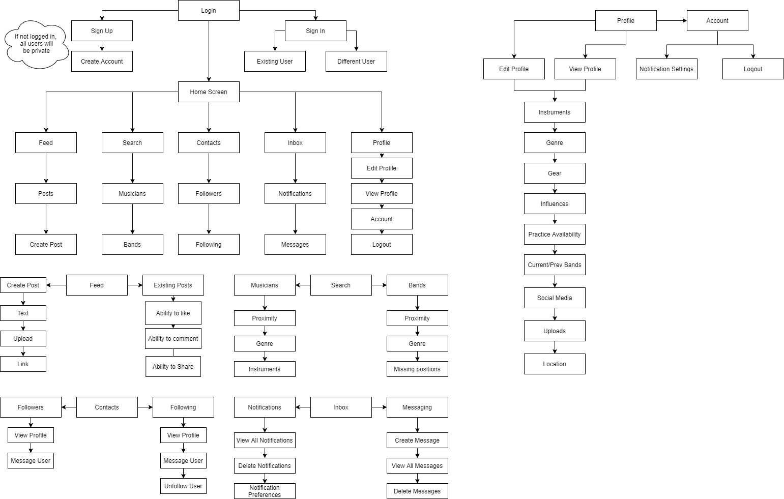

# Jam ATX 
## Core Functions
- Jam ATX is a geolocating social application that makes it easier to find bandmates or simply people to play music with. 
- Removes intimidating process of hunting people down within a social setting
#### Users will have the freedom to:
- Create their own page focusing on preferred genre & musical influences.
- Provide availibility for practice times & practice space of choice.
- Learning style/what role they would like to take within the band. 
- Gear they are willing to bring
- Link their Bandcamp, SoundCloud, Discogs, and Reverb accounts
- Upload recordings through audio and/or video

#

Possible future extension that allows remote jam sessions through webcam service

